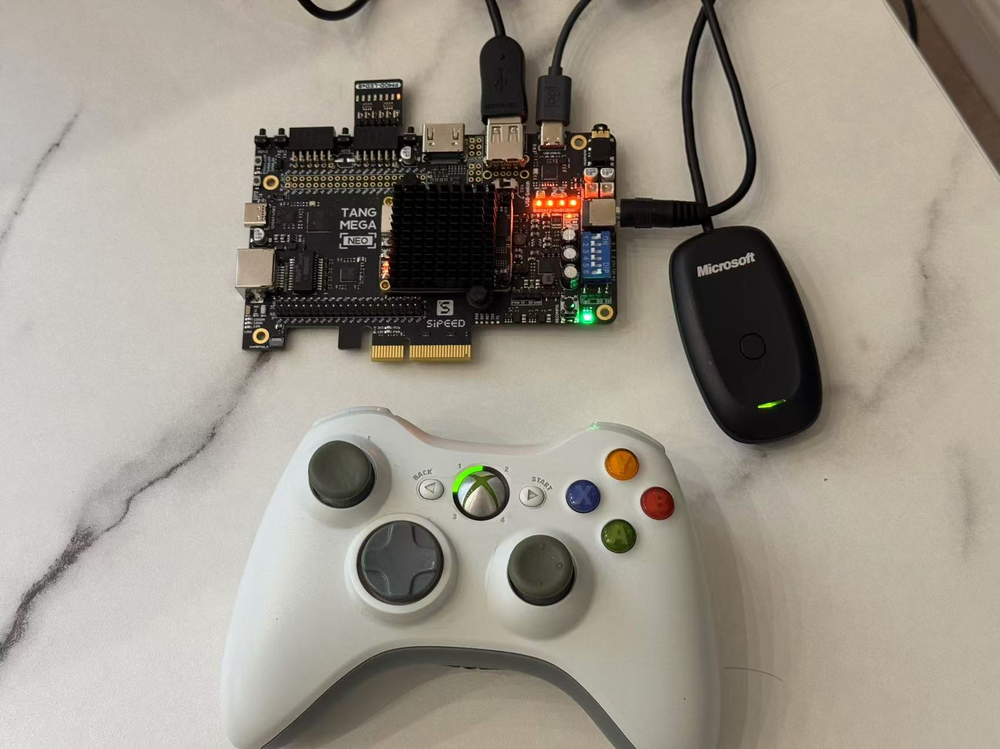
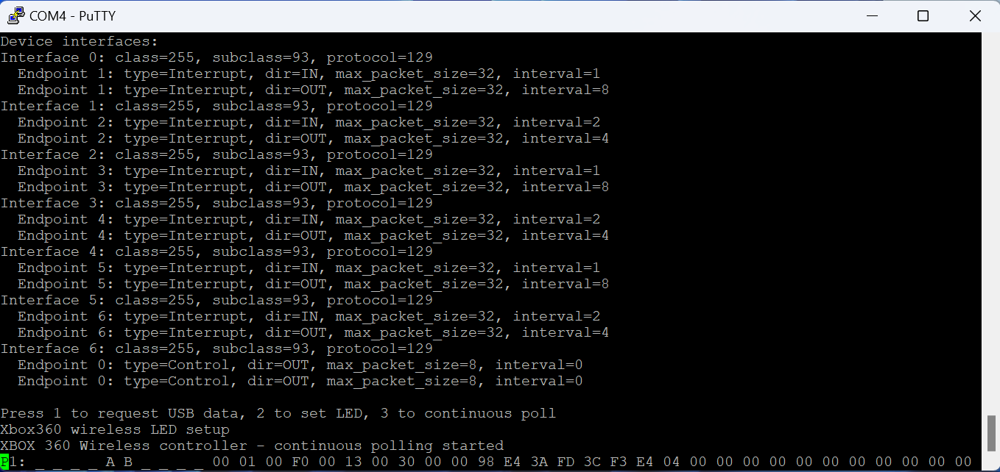
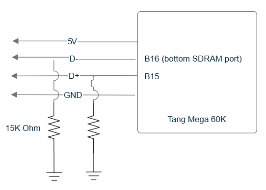

## Full-speed USB Host on Tang FPGA

This is a full-speed USB (USB 1.1) host example on Tang Mega 60K. It uses a soft CPU ([VexRiscv](https://github.com/SpinalHDL/VexRiscv)) with an USB host module ([core_usb_host](https://github.com/ultraembedded/core_usb_host), with some code from [usb1_host](https://github.com/dineshannayya/usb1_host)). A simple firmware program demonstrates how to read from an Xbox 360 wireless controller. It supports reading of all control interface data, and controlling of LEDs on the controller.

Test set up:

Screenshot:

Wiring diagram. The mega 60K has an on-board USB-A socket. So in theory that should simply work. Somehow that does not work for me. So I wired up the port as follows.

nand2mario, 10/2024

## References
* [USB made simple](https://www.usbmadesimple.co.uk/)
* [USB in a nutshell](https://www.beyondlogic.org/usbnutshell/)
* [Linux xpad driver](https://github.com/paroj/xpad)
* [Xbox 360 controller protocol](https://github.com/xboxdrv/xboxdrv/blob/stable/PROTOCOL)
* [Understanding the Xbox 360 Wired Controller’s USB Data](https://www.partsnotincluded.com/understanding-the-xbox-360-wired-controllers-usb-data/)
